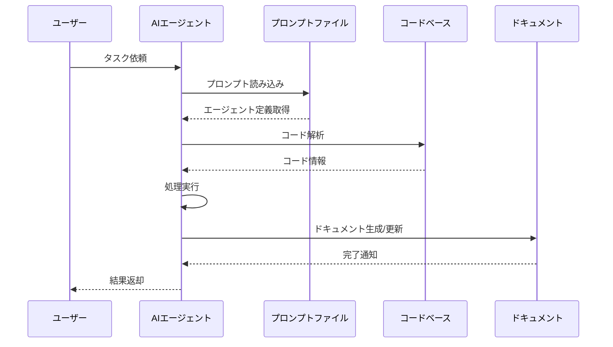
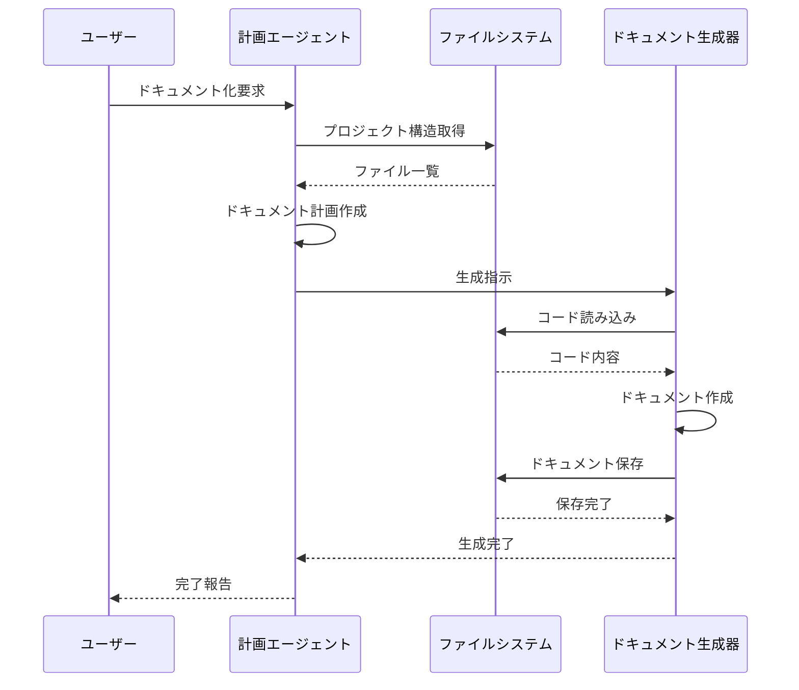
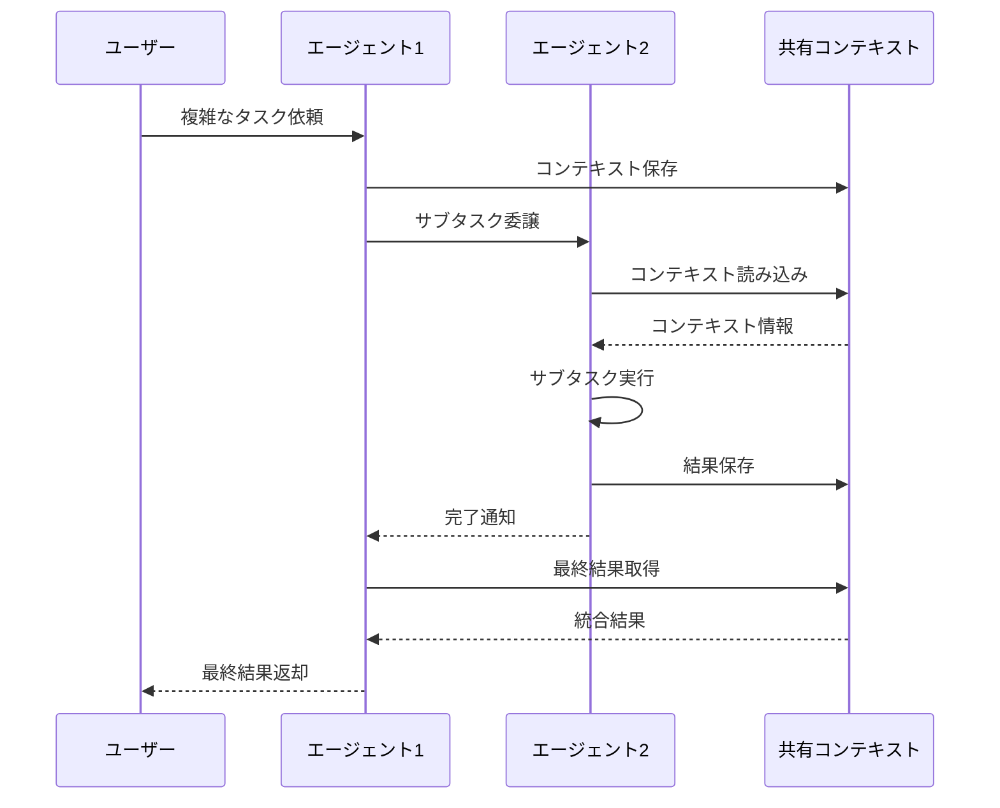

# シーケンス図

## エージェント実行フロー

```mermaid
sequenceDiagram
    participant User as ユーザー
    participant Agent as AIエージェント
    participant Prompt as プロンプトファイル
    participant Code as コードベース
    participant Docs as ドキュメント

    User->>Agent: タスク依頼
    Agent->>Prompt: プロンプト読み込み
    Prompt-->>Agent: エージェント定義取得
    Agent->>Code: コード解析
    Code-->>Agent: コード情報
    Agent->>Agent: 処理実行
    Agent->>Docs: ドキュメント生成/更新
    Docs-->>Agent: 完了通知
    Agent-->>User: 結果返却
```

## ドキュメント自動化フロー

```mermaid
sequenceDiagram
    participant User as ユーザー
    participant PlanAgent as 計画エージェント
    participant FileSystem as ファイルシステム
    participant DocGenerator as ドキュメント生成器

    User->>PlanAgent: ドキュメント化要求
    PlanAgent->>FileSystem: プロジェクト構造取得
    FileSystem-->>PlanAgent: ファイル一覧
    PlanAgent->>PlanAgent: ドキュメント計画作成
    PlanAgent->>DocGenerator: 生成指示
    DocGenerator->>FileSystem: コード読み込み
    FileSystem-->>DocGenerator: コード内容
    DocGenerator->>DocGenerator: ドキュメント作成
    DocGenerator->>FileSystem: ドキュメント保存
    FileSystem-->>DocGenerator: 保存完了
    DocGenerator-->>PlanAgent: 生成完了
    PlanAgent-->>User: 完了報告
```

## エージェント間連携フロー

```mermaid
sequenceDiagram
    participant User as ユーザー
    participant Agent1 as エージェント1
    participant Agent2 as エージェント2
    participant SharedContext as 共有コンテキスト

    User->>Agent1: 複雑なタスク依頼
    Agent1->>SharedContext: コンテキスト保存
    Agent1->>Agent2: サブタスク委譲
    Agent2->>SharedContext: コンテキスト読み込み
    SharedContext-->>Agent2: コンテキスト情報
    Agent2->>Agent2: サブタスク実行
    Agent2->>SharedContext: 結果保存
    Agent2-->>Agent1: 完了通知
    Agent1->>SharedContext: 最終結果取得
    SharedContext-->>Agent1: 統合結果
    Agent1-->>User: 最終結果返却
```
